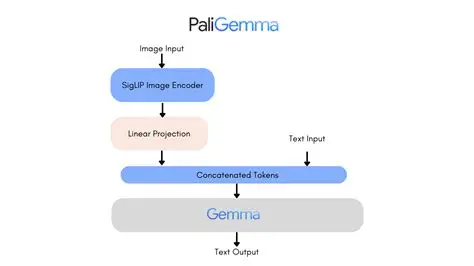

# Vision Transformer: PaliGemma in PyTorch 

 A from-scratch PyTorch implementation of Google's PaliGemma, a powerful open-source vision-language model.

## About the project
This repository contains a self-contained, from-scratch implementation of the PaliGemma architecture in PyTorch. The project combines a SigLIP Vision Transformer for image understanding with a Gemma language model for text generation, allowing the model to perform multimodal tasks like visual question answering and image captioning.

The goal of this project is to provide a clear and understandable codebase for researchers, students, and enthusiasts to explore the inner workings of modern vision-language models.

###  inference.py
This is the main executable script used to run the model. It handles parsing command-line arguments (like the prompt and image path), loads the model and processor, prepares the inputs, and runs the generation loop to produce an output.

###  utils.py
This utility script contains helper functions, most importantly the load_hf_model function. Its primary role is to read the model's configuration from config.json and load the trained weights from all the .safetensors files into the model's architecture.

###  processing_paligemma.py
This file defines the PaliGemmaProcessor, a custom class responsible for preparing data for the model. It takes raw text and images and converts them into the correct numerical format (token IDs and pixel tensors) that the model expects, including adding special tokens like <image>.

###  modeling_gemma.py
This script contains the PyTorch implementation of the Gemma language model architecture. It includes the core components like GemmaAttention, GemmaMLP, and the final PaliGemmaForConditionalGeneration class which combines the vision and language models together.

###  modeling_siglip.py
This script contains the PyTorch implementation of the SigLIP vision model. It defines the SiglipVisionTransformer which acts as the image encoder, taking an image and converting it into a sequence of embeddings that the language model can understand.
